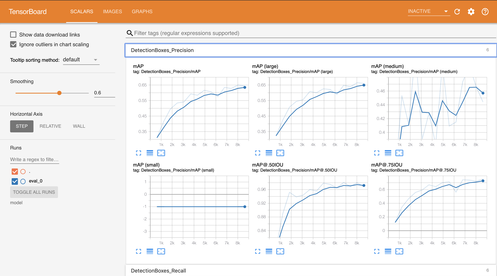
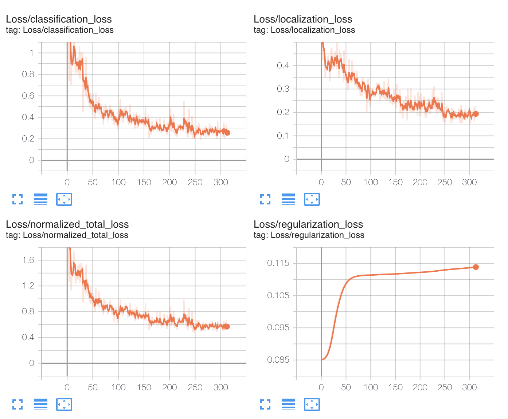
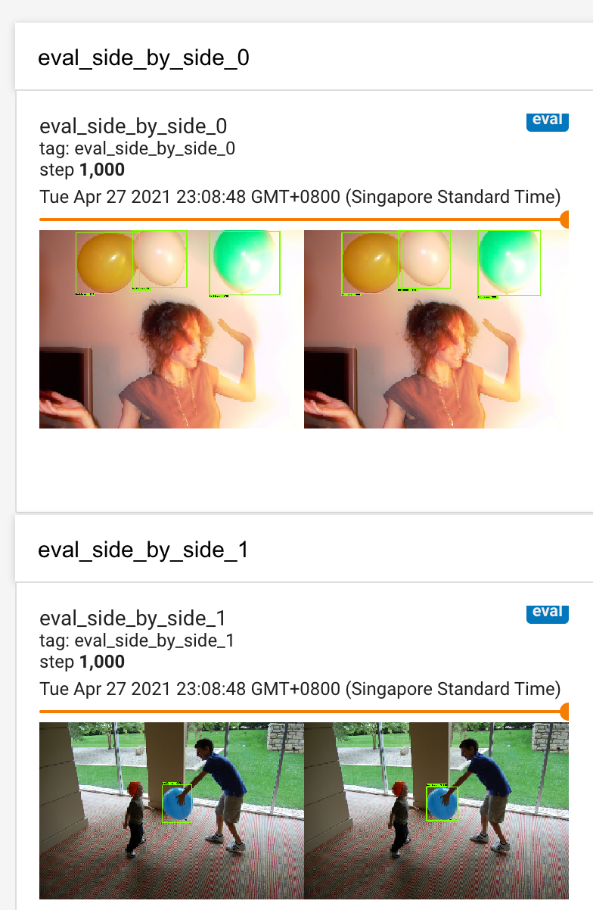

# Training a Custom Object Detector

Welcome to this week's hands-on lab. In this lab, we are going to learn how to train a balloon detector! 

At the end of this exercise, you will be able to:

- create dataset in Tensorflow Records format (TFRecords) 
- use a pretrained model to shorten training time required for object detection 
- configure training pipeline of Tensorflow Object Detection API (TFOD API)
- train a custom object detector and monitor the training progress
- deploy the trained model for object detection 

***Pre-requisites***

If you are using the cloud VM provided, you can skill the following installation steps as all the necessary pre-requisites have already been installed.

You need to first clone the TFOD repo to your machine:

```

cd ~/git
mkdir tensorflow 
cd tensorflow 
git clone https://github.com/tensorflow/models.git

```

You will also need protobuff compiler. You can install it using the following command:

```
sudo apt install -y protobuf-compiler
```

You will then build the python package and install it using pip. 

```
cd models/research

# Compile protos.
protoc object_detection/protos/*.proto --python_out=.
# Install TensorFlow Object Detection API.
cp object_detection/packages/tf2/setup.py .
python -m pip install --use-feature=2020-resolver .

# Test the installation.
python object_detection/builders/model_builder_tf2_test.py

```
***Note***

- Some familiarity with Linux shell command is required for this lab.
- If you are using the Cloud VM provided, the TFOD API and its required libraries has been installed
and configured. Make sure you use the ``tf2env`` conda environment, i..e in your terminal, always remember to ``conda activate tf2env``. 
- The commands below assumed you are using Bash shell on Linux. 
- The referenced paths and the instructions below assumes you are using the Cloud VM provided.
- ``lab folder`` in the instructions below refers to the folder where this practical is located.
- ``home folder`` refers to ``/home/ubuntu`` for the cloud VM. 

## Create the project folder structure

As we will be dealing with a lot of different files, such as training config files, models, annotation files and images, it is important to have certain folder structure to organise all of these. A project folder has been created for you and you can copy the folder ``balloon_project`` from  IT3103 git repo to the home folder. By default, your IT3103 git is located at ``/home/ubuntu/temp-git ``. Run the following command to copy the folder: 

```
cp -r ~/temp-git/it3103/week5/balloon_project ~/balloon_project
```


following structure is used for our project. 

```
balloon_project
-annotations
-data
 -images
 -annotations
-exported-models
-models
-pretrained-models
```

The folders will be used for storing the files mentioned below:

- ``balloon_project/``: the root folder of the project
- ``balloon_project/data/``: label mapping file (label_map..pbtxt) and TFRecords (e.g. train.record, val.record)
- ``balloon_project/exported-models``: used to store the custom trained model, in SavedModel format.
- ``balloon_project/data/images``: used to store the images
- ``balloon_project/data/annotations``: the annotation files in Pascal VOC XML format
- ``balloon_project/models``: for storing the training checkpoints of different models (e.g. you can have one subfolder ``models/ssd_resnet101_v1_fpn_640x640_coco17_tpu-8`` for training model based on ``ssd_resnet`` pretrained model and ``models/ssd_mobilenet_v2_320x320_coco17_tpu-8`` for model based on ``ssd_mobilenet`` pretrained model.  Each of the subfolder also contains the pipeline.config file which is the configuration file used for training and evaluating the detection model.
- ``balloon_project/pretrained_models``: the pretrained model checkpoints that you downloaded (use different subfolder for different pretrained-models).


## Download the Training Data

Let's use an existing data set that is already annotated for this exercise. To download the data, type the following in the terminal (the bash shell):

```bash
wget https://nyp-aicourse.s3-ap-southeast-1.amazonaws.com/datasets/balloon_dataset_pascalvoc.zip
```

Unzip the file to the a folder (e.g. balloon_dataset): 

```
unzip balloon_dataset_pascalvoc.zip -d /home/ubuntu/balloon_dataset
```

You will see a list of jpg files (the images) and xml files (the Pascal VOC format annotation files), like below: 

```
balloon_dataset
-balloon-1.jpg
-balloon-1.xml
-balloon-2.jpg
-balloon-2.xml
...
```

You will notice that the files are named ``balloon-1.jpg, balloon-2.jpg, ...``  and so on. It is a good practice to name your image files with certain fixed pattern like this so that you can write script to process them more easily (e.g. splitting into train/val dataset, shuffling, sorting, etc)

### Copy the images and annotation files to project folder

From the ``balloon_dataset`` directory, copy image files (a total of 74 images) to ``balloon_project/data/images/`` respectively.  Type the following in the terminal:

```
cp  ~/balloon_dataset/*.jpg  ~/balloon_project/data/images/
```

From the ``balloon_dataset``, copy all the .xml files  to `balloon_project/data/annotations`. 

```
cp ~/balloon_dataset/*.xml  ~/balloon_project/data/annotations/
```

*Note:* In linux, the tilde sign `~` is just a shortcut to home folder, i.e. /home/ubuntu in our case.

You can also collect your own images and annotate them using tools such as LabelImg. Refer to ``annotation.md`` for some instructions on how to use it.

## Create Label Map

TFOD API requires a label map (.pbtxt) file, which contains mapping of the used labels to an integer values. This label map is used in both the training and detection processes. 

For example, if the dataset contains 2 labels, dogs and cats, then our label map file will have the following content:

```
item {
    id: 1
    name: 'cat'
}
item {
    id: 2
    name: 'dog'
}
```

Since we are detecting only 1 object (balloon), there is only 1 label required for our .pbtxt file. 

Create a ``label_map.pbtxt`` file (using editor such as nano editor, or Jupyter lab editor) in the ``data`` folder with that contains only one label mapping for balloon. 

```
cd ~/balloon_project/data
nano label_map.pbtxt
```

Then type the following content in the editor.

```
item {
    id: 1
    name: 'balloon'
}
```

## Creating TensorFlow Records

TFOD API requires the training/validation data to be stored as TF Records (binary) format. 

From the lab folder, run the following python script to convert the data (images and annotations) to TFRecords: 

``` bash
DATA_DIR=/home/ubuntu/balloon_project/data
LABELMAP=/home/ubuntu/balloon_project/data/label_map.pbtxt
OUTPUT_DIR=/home/ubuntu/balloon_project/data
TEST_RATIO=0.2

python create_tf_records_voc.py \
      --data_dir="${DATA_DIR}" \
      --label_map="${LABELMAP}" \
      --test_ratio="${TEST_RATIO}" \
      --output_dir="${OUTPUT_DIR}"
```

To save you from typing, a shell script ``create_tf_voc.sh`` has been provided.  Make sure all the paths are correct and then run the shell script as follows: 

```
cd ~/balloon_project 
bash create_tf_voc.sh 
```

You will see that two records created in the directory ~/balloon_project/data:  
``train.record`` and ``val.record``.


## Download pretrained model

Training a state of the art object detector from scratch can take days, even when using multiple GPUs!
In order to speed up training, we'll take an object detector that is pre-trained on a different dataset (COCO), and 
reuse some of it's parameters to initialize our new model. You can download the pre-trained model from Tensorflow model zoo. 

```
## Download the pre-trained model to your home directory
cd ~

wget http://download.tensorflow.org/models/object_detection/tf2/20200711/ssd_mobilenet_v2_320x320_coco17_tpu-8.tar.gz
    
## unzip the model.tar.gz to the project pretrained_models subdirectory
tar xzvf ssd_mobilenet_v2_320x320_coco17_tpu-8.tar.gz -C ~/balloon_project/pretrained-models/
```

You will see a folder called ``'ssd_mobilenet_v2_320x320_coco17_tpu-8'`` that contains subfolders called ``checkpoint`` and ``saved_model`` and also a pipeline.config file specific to this model. You can configure your training and evaluation by doing some setting in this file (see the next section how to configure this file).  

The checkpoint directory contains the checkpoints that we can use for training our custom model, with the names like ``ckpt-0.*``. 

The saved_model directory contains the SavedModel that we can use to do inference. This SavedModel can be loaded directly using ``tf.keras.models.load_model()``.

## Configure the Object Detection Pipeline

We will now configure the training pipeline for our object detector. Depending on which detector algorithm and the feature extractor you are using, the configuration will be different.  A pipeline.config file is packaged together with the pretrained model you downloaded from model zoo.  Copy the pipleine.config file to the ``models/<pretrained-model-name>`` as follows: 

```bash
# create the target directory first 
mkdir ~/balloon_project/models/ssd_mobilenet_v2_320x320_coco17_tpu-8/

# copy the pipeline.config file to the target folder
cp ~/balloon_project/pretrained-models/ssd_mobilenet_v2_320x320_coco17_tpu-8/pipeline.config ~/balloon_project/models/ssd_mobilenet_v2_320x320_coco17_tpu-8/pipeline.config
```

Open the ``pipeline.config`` file located in ``models/ssd_mobilenet_v2_320x320_coco17_tpu-8`` directory with an editor and modify the following sections:

```
model {
    ssd {
        num_classes: 1
    ...
}


train_config: {
  batch_size: 10
  ...
  optimizer {
    momentum_optimizer {
      learning_rate {
        cosine_decay_learning_rate {
          learning_rate_base: 0.03999999910593033
          total_steps: 25000
          warmup_learning_rate: 0.013333000242710114
          warmup_steps: 2000
        }
      }
      ...
    }
    ...
  }
  fine_tune_checkpoint: "/home/ubuntu/balloon_project/pretrained-models/ssd_mobilenet_v2_320x320_coco17_tpu-8/checkpoint/ckpt-0"
  ...
    
  fine_tune_checkpoint_type: "detection" # Set this to "detection" since we want to be training the full detection model
  use_bfloat16: false # Set this to false if you are not training on a TPU
}

...

train_input_reader: {
  label_map_path: "/home/ubuntu/balloon_project/data/label_map.pbtxt"
  tf_record_input_reader {
      input_path: "/home/ubuntu/balloon_project/data/train.record"
  }
}
...

eval_input_reader: {
  label_map_path: "/home/ubuntu/balloon_project/data/label_map.pbtxt"
  shuffle: false
  num_epochs: 1
  tf_record_input_reader {
     input_path: "/home/ubuntu/balloon_project/data/val.record"
  }
}
```

**Note about Batch Size and Learning Rate** 

_The original pipeline.config uses a batch size of 512 and correspondingly having a higher learning rate will be appropriate. However, since our GPU memory is limited, we have to use a smaller batch size (e.g. 10), and thus we must use smaller learning rate instead._

If you want to find out more information on configuring the pipeline, please refer to [TFOD API documentation on pipeline](https://github.com/tensorflow/models/blob/master/research/object_detection/g3doc/configuring_jobs.md)
for more information.


## PRE-CHECK Before Training

Before you start training, make sure your tensorflow can detect and use the GPU, if not, it will fallback on CPU for training and your training will take forever to finish. 

```
# start the python interpretor by typing python at the terminal. make sure you are in tf2env 
python 
>>import tensorflow as tf
>>tf.test.is_gpu_available()
True
```

If the output is False, inform your teacher to see what is the problem. 

## Start the training 


You can start the training by running `model_main2.py` from the directory 
`tensorflow/models/research directory`, and passing the various parameters such as config path, the directory to save the model checkpoints to, etc. 

**Note**: on the server the tensorflow directory is located at `/home/ubuntu/git`)

```
MODEL=ssd_mobilenet_v2_320x320_coco17_tpu-8
CUDA_VISIBLE_DEVICES=0
PIPELINE_CONFIG_PATH=/home/ubuntu/balloon_project/models/${MODEL}/pipeline.config
MODEL_DIR=/home/ubuntu/balloon_project/models/${MODEL}/
python /home/ubuntu/git/tensorflow/models/research/object_detection/model_main_tf2.py \
    --pipeline_config_path="${PIPELINE_CONFIG_PATH}" \
    --model_dir="${MODEL_DIR}" \
    --alsologtostderr
```

A script (`train.sh`) that contains the above has been created to avoid typing this repeatedly. Modify the script to change the MODEL accordingly, if you are using another pretrained model e.g. ``ssd_resnet101_v1_fpn_640x640_coco17_tpu-8``.

After the script is run, you may see a lot of warning messages and you can safely ignore those (most of them are due to deprecation warning). 
If everything goes smoothly, you will start seeing the following training output:


## Start the evaluation

To see how model performs on validation set, you need to run evaluation script separately (in the previous version, the tensorflow object detection team combined both the train and eval in single script, alternating between train and evaluation, so you only need to run one script). As the training process is already using up ALL the GPU memory, your eval script will complain about OOM (out-of-memory) error when evaluation script is trying to allocate tensors in the GPU. If you have multiple GPU on your machine, you can always direct the evaluation script to run on a separate GPU (e.g. by setting CUDA_VISIBLE_DEVICES='2' to target GPU 2) But in our case, we only have a single GPU. So one workaround is to force the eval script to run using CPU instead. 

You can run the evaluation using model_main_tf2.py provided by TFOD API. The script will run evaluation instead of training if a ``checkpoint_dir`` is passed as an argument like below: 

```
MODEL=ssd_mobilenet_v2_320x320_coco17_tpu-8
CUDA_VISIBLE_DEVICES=""
PIPELINE_CONFIG_PATH=/home/ubuntu/balloon_project/models/${MODEL}/pipeline.config
MODEL_DIR=/home/ubuntu/balloon_project/models/${MODEL}/
CHECKPOINT_DIR=/home/ubuntu/balloon_project/models/${MODEL}/
python /home/ubuntu/git/tensorflow/models/research/object_detection/model_main_tf2.py \
    --pipeline_config_path="${PIPELINE_CONFIG_PATH}" \
    --model_dir="${MODEL_DIR}" \
    --checkpoint_dir="${CHECKPOINT_DIR}" \
    --alsologtostderr
```

To save you from typing repeatedly the commands above, an ``eval.sh`` is provided for you. 

Open a new terminal and do the following:

```
conda activate tf2env
export CUDA_VISIBLE_DEVICES=""
cd ~/balloon_project/
bash eval.sh
```

What we are doing here is to tell the tensorflow that we don't have any CUDA-capable device to use, and it will fall back to using only CPU. 
    
Now it is time to grab your coffee, sit back and relax :) 


 

## Monitoring Training Progress with Tensorboard 

You can monitor progress of the training and eval jobs by running Tensorboard on your local machine:

Open another terminal and run the tensorboard, specifying the model directory as logdir. Remember to ``conda activate tf2env`` before you run the tensorboard.

```
tensorboard --logdir=/home/ubuntu/balloon_project/models/ssd_mobilenet_v2_320x320_coco17_tpu-8
```

Once Tensorboard is running, navigate to `<cloudVM-IPaddress>:6006` from your favourite web browser. 
(if you are running this in the cloud VM, and accessing it from school computer, port 6006 is blocked. 
You should access it by using `https://<cloudVM-IPaddress>/tensorboard`, using the reverse proxy we have setup on the cloud VM)

You should be able see various charts such as following (after training it for 5 to 10 minutes), which is generated by the evaluation script. Here you can see the plots for the varios mAP metrics over the training steps, as well as the different training loss, e.g the classification loss and regression loss and also total loss. 






You can also see the evaluation results on the images by selecting the `Images` tab. Here you can see a 
comparison of the ground truth bounding boxes (right) and the predicted bounding boxes (left). Initially you will see that the bounding boxes were not very accurately drawn and may have multiple detections. But as training progresses, the detection should get better and better. 

 


Note that there is also another loss called 'loss'. This is the total training loss, consisting loss from classification, regression, etc.

**Questions:**

- How is your model mAP at 0.5 IOU? 

- How is your model mAP on small objects? large objects?

- Is your model overfitting?

  

## Stop Training 

Your training can take quite a while (1 to 2 hours).
You can determine if you can stop the training by looking at the validation loss or mAP. If the validation loss has plateued out for a few epochs, or you have achieved a good enough mAP, you can probably stop the training. 

To stop the training, just type ``CTRL-C`` at the terminal to kill the train.sh script. You should also stop the eval.sh and tensorboard using ``CTRL-C`` too.

##  IMPROVING YOUR MODEL

To improve the model performance, you can try to experiment with different learning rate, regularization, dropout, etc. 

You can also try other pretrained model from Tensorflow model zoo, for example using the resnet-based feature extractor.

## Exporting the Tensorflow Graph

After your model has been trained, you should export the inference graph to a standard exported model folder structure (same as the model you downloaded from TF2 Model Zoo) so that it can be used later. We can use the script provided by the TFOD API, exporter_main_v2.py and supply the arguments such as the pipeline config file, checkpoint directory, etc. like the following:

```
MODEL=ssd_mobilenet_v2_320x320_coco17_tpu-8
PIPELINE_CONFIG_PATH=/home/ubuntu/balloon_project/models/${MODEL}/pipeline.config
MODEL_DIR=/home/ubuntu/balloon_project/models/${MODEL}/
TRAIN_CHECKPOINT_DIR=/home/ubuntu/balloon_project/models/${MODEL}/
EXPORT_DIR=/home/ubuntu/balloon_project/exported_models/${MODEL}/

python /home/ubuntu/git/tensorflow/models/research/object_detection/exporter_main_v2.py \
    --input_type image_tensor \
    --pipeline_config_path ${PIPELINE_CONFIG_PATH} \
    --trained_checkpoint_dir ${TRAIN_CHECKPOINT_DIR} \
    --output_directory ${EXPORT_DIR}
    
```

Before running the export script, make sure you have stopped the training process on the GPU (on a CPU, there is no need to stop), as it will make use of the same GPU memory that you are running your training process, and it will throw a out-of-memory error. 

A convenience script (`export.sh`) that contains the above has been created to avoid typing this repeatedly. 

Afterwards, you should see the following contents in `exported-models\ssd_mobilenet_v2_320x320_coco17_tpu-8`: 

```
- checkpoint 
  - checkpoint
  - ckpt.0.data-00000-of-00001
  - ckpt-0.index
- saved_model
  - assests
  - variables
  - saved_model.pb
pipeline.config 
```

However, in this new version of TFOD, exporter_main_v2.py only exports the latest checkpoint. However, we may want to export the earlier checkpoint, as the earlier checkpoint may have the best performance. One workaround is to modify the ``checkpoint`` file in the training checkpoint directory (e.g. ~/balloon_project/models/ssd_mobilenet_v2_320x320_coco17_tpu-8), and change the name to other checkpoint file name. 

For example, the ``checkpoint`` file may have the following original content: 

```

model_checkpoint_path: "ckpt-12"
all_model_checkpoint_paths: "ckpt-6"
all_model_checkpoint_paths: "ckpt-7"
all_model_checkpoint_paths: "ckpt-8"
all_model_checkpoint_paths: "ckpt-9"
all_model_checkpoint_paths: "ckpt-10"
all_model_checkpoint_paths: "ckpt-11"
all_model_checkpoint_paths: "ckpt-12"
all_model_checkpoint_timestamps: 1601611588.861176
all_model_checkpoint_timestamps: 1601612029.9504316
all_model_checkpoint_timestamps: 1601612471.713808
all_model_checkpoint_timestamps: 1601612913.4279857
all_model_checkpoint_timestamps: 1601613356.2644634
all_model_checkpoint_timestamps: 1601613798.8340204
all_model_checkpoint_timestamps: 1601614241.2990458
last_preserved_timestamp: 1601609353.4315968

```

The first line indicates the checkpoint filepath of the latest checkpoint, in this case ckpt-12. If we want to use ckpt-9 instead, then just change the first line to 'ckpt-9'. 

A note about the checkpoint number. In TFOD 2, the checkpoint number is no more representing the training step. It is just a running sequence number: a new number for a new checkpoint. So how do we know which checkpoint number to use? 

In this version of TFOD, during the training loop, a checkpoint is created every 1000 training steps by default. So just multiply the number with the 1000 to get the corresponding steps. You can control how frequent the checkpoint is created by passing in the argument ``--checkpoint_every_n``. 

## Test your custom model

Now you are ready to test your trained model. Run the provided notebook `detect_balloon.ipynb`  to run your balloon detector!

### Using our pre-trained model 

We have already trained the balloon detector on a GPU server. You can try out our trained model. Change directory to your balloon project directory and download our model using: 

```
wget https://nyp-aicourse.s3-ap-southeast-1.amazonaws.com/pretrained-models/balloon_model.tar.gz -C exported-models/ssd_mobilenet_v2_320x320_coco17_tpu-8

tar xzvf balloon_model.tar.gz
```

After unzip and untar, you will see a folder *export_model*. In your codes, just change your path to point to the *saved_model* subfolder of the *export_model*
